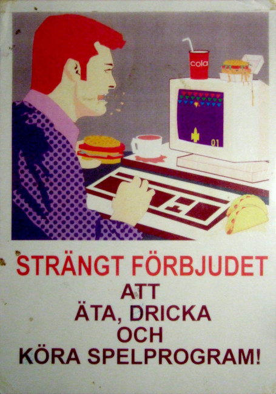

#### Computer lab code of conduct

Software used: Gimp, Inkscape.

The file spelprogram_colorcorr.png is the image being traced. spelprogram_mediancolor.png is used to sample colors from in the most evenly and brighly lit areas for the SVG replica.

### English translation:

STRONGLY FORBIDDEN
TO
EAT, DRINK
AND
EXECUTE GAMES SOFTWARE!